# MLOps Pipeline — Classification & Detection (Kubernetes)

Template MLOps đầy đủ cho **phân loại ảnh (Classification)** và **phát hiện vật thể (Detection)**, chạy trên Kubernetes local với Helm.

---

## Tại sao cần MLOps?

Train model xong là bước khởi đầu, không phải kết thúc:

- Train đi train lại nhiều lần — không nhớ lần nào tốt nhất
- Data thay đổi — không biết model đang chạy trên data version nào
- Không có công cụ thống nhất cho đội gắn nhãn
- Model production — không biết có đang hoạt động đúng không

MLOps tự động hóa toàn bộ pipeline:

```
Data → Label → Train → Evaluate → Deploy → Monitor → (Retrain khi cần)
```

---

## Các thành phần

| Component | Vai trò |
|-----------|---------|
| **Labeling Tool** | Web app gắn nhãn nội bộ — Upload, vẽ bbox / chọn class, theo dõi tiến độ ¹ |
| **MLflow** | Tracking experiments, so sánh trials, quản lý model alias `champion` |
| **MinIO** | S3-compatible storage — lưu ảnh, model artifacts, snapshots/datasets |
| **FastAPI** | Serve model `POST /predict` — classification label / detection boxes |
| **Drift Detector** | CronJob chạy mỗi giờ — so sánh embedding inference vs reference, gửi email cảnh báo |
| **Prometheus + Grafana** | Monitor request rate, latency, error rate |
| **GitHub Actions** | CI/CD — tự động train + deploy khi push code/data |

---

## Yêu cầu

- **Docker Desktop** (Settings → Resources → Memory ≥ 4GB)
- **Minikube**, **kubectl**, **Helm**, **Git**
- **Python 3.11+** — chạy scripts cục bộ
- **Windows Terminal** (Windows) hoặc **tmux** (Linux/macOS) — để chạy port-forward

---

## Cấu trúc project

```
mlops_local_k8s/
├── .github/workflows/mlops_pipeline.yml  # CI/CD pipeline
├── src/
│   ├── train.py                          # Orchestration: config, dataset, Optuna, MLflow
│   ├── cls_trainer.py                    # Classification trainer
│   ├── dct_trainer.py                    # Detection trainer
│   ├── registry_loader.py                # Download dataset từ MinIO + PostgreSQL
│   ├── embedding_utils.py                # Extract embedding (drift detection)
│   ├── models/
│   │   ├── models.py                     # Factory build_model() — baked vào image
│   │   ├── pretrained.py                 # Backbones registry — inject qua ConfigMap
│   │   ├── custom.py                     # Custom models — inject qua ConfigMap
│   │   └── utils.py                      # Shared utils — inject qua ConfigMap
│   ├── params.yaml                       # Config người dùng tạo (copy từ src/config/)
│   └── config/
│       ├── load.py
│       ├── params_config_cls.yaml        # Example config — Classification
│       └── params_config_dct.yaml        # Example config — Detection
├── serving/app.py                        # FastAPI serving
├── labeling/
│   ├── backend/                          # FastAPI + PostgreSQL
│   └── frontend/                         # Vue 3 + Nginx
├── docker/
│   ├── Dockerfile.base                   # Base image (PyTorch)
│   ├── Dockerfile.trainer
│   └── Dockerfile.api
├── mlops_chart/                          # Helm chart
│   ├── values.example.yaml               # Copy thành values.yaml
│   └── templates/
├── requirements/
├── setup.ps1                            # Setup lần đầu — Windows
├── setup.sh                             # Setup lần đầu — Linux/macOS
├── port-forward.ps1                     # Mở port-forwards — Windows
└── port-forward.sh                      # Mở port-forwards — Linux/macOS
```

### Stable vs Dynamic files

| File | Loại | Cách deploy |
|------|------|-------------|
| `src/train.py`, `cls_trainer.py`, `dct_trainer.py` | Stable | Baked vào Docker image |
| `src/registry_loader.py`, `embedding_utils.py` | Stable | Baked vào Docker image |
| `src/models/models.py`, `src/config/` | Stable | Baked vào Docker image |
| `src/models/pretrained.py`, `custom.py`, `utils.py` | Dynamic | Inject qua ConfigMap lúc runtime |

---

> ¹ **Tại sao không dùng Label Studio / CVAT?** Project này tập trung vào MLOps pipeline — cách data đi từ label đến train đến serve đến monitor. Labeling tool ở đây chỉ để có data đầu vào, không phải focus chính. Dùng Label Studio đòi hỏi giải quyết thêm integration (export format, connector MinIO, viết lại snapshot system) — làm phức tạp demo mà không giúp hiểu pipeline hơn. Production thật với nhiều annotator thì Label Studio là lựa chọn đúng.

---

## Demo

Pipeline chạy thực tế trên MNIST subset (3 class: 0, 6, 8 — 3000 ảnh).

### 1. Setup

Script tự động kiểm tra tools, start Minikube, build Docker images và deploy toàn bộ stack lên K8s.

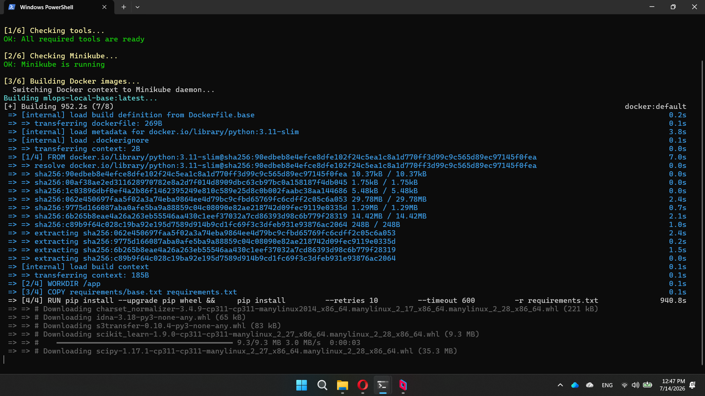

---

### 2. Gắn nhãn dữ liệu

Upload ảnh bằng cách kéo thả hoặc chọn folder. Hỗ trợ 3 format: Classification (ImageFolder), Detection (YOLO), hoặc ảnh lẻ chưa có nhãn.

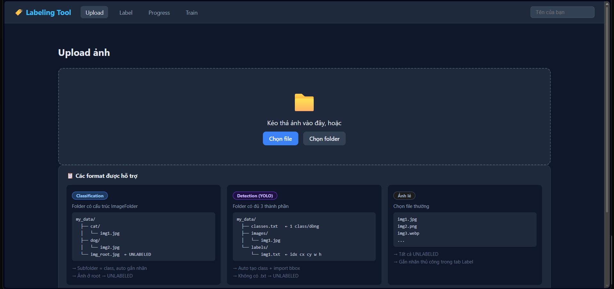

Chọn folder — tool tự phát hiện classes từ cấu trúc thư mục và preview ảnh trước khi upload.

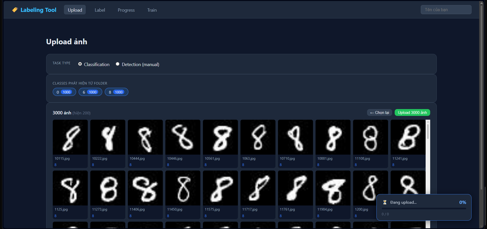

Upload 3000 ảnh theo batch lên MinIO. Tiến độ hiển thị realtime.

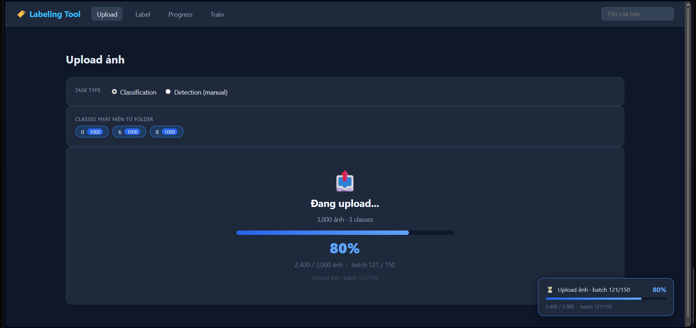

Sau khi upload, vào tab **Label** để gắn nhãn thủ công cho ảnh chưa có class.

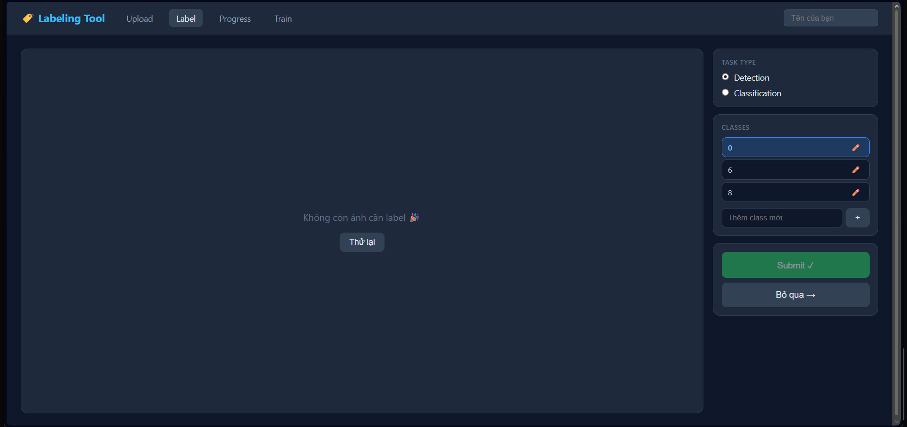

Tab **Progress** theo dõi tiến độ toàn bộ dataset — 3000/3000 ảnh đã label, phân bố đều 1000 ảnh/class.

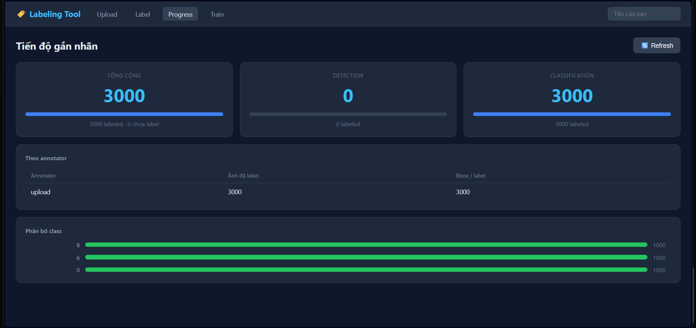

Khi đủ data, tab **Train** tạo snapshot dataset và trigger CI/CD pipeline trên GitHub Actions.

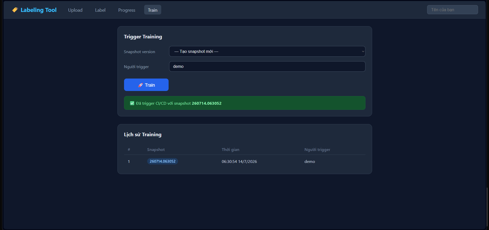

---

### 3. CI/CD Pipeline

GitHub Actions tự động chạy khi nhận commit. Self-hosted runner chạy trên máy local — kết nối và chờ job.

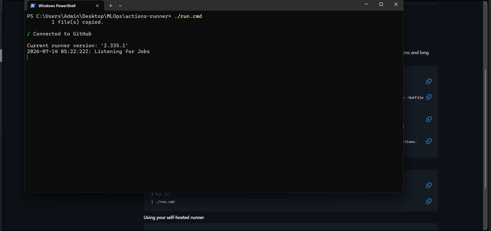

Pipeline bắt đầu — kiểm tra dataset version, build image (nếu cần), tạo ConfigMaps, deploy trainer.

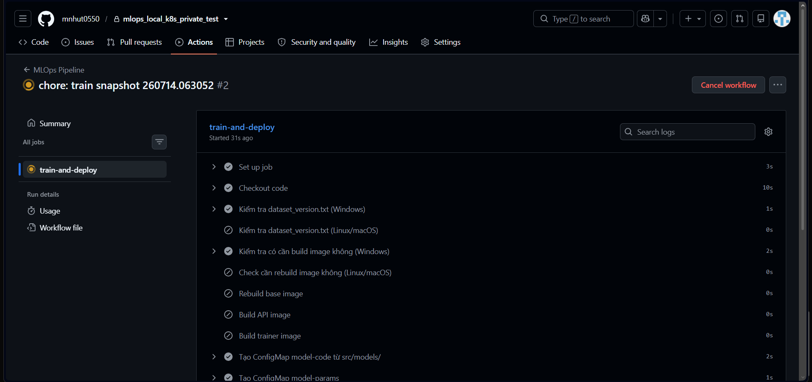

Helm upgrade bật trainer Job + API, sau đó đợi trainer chạy xong.

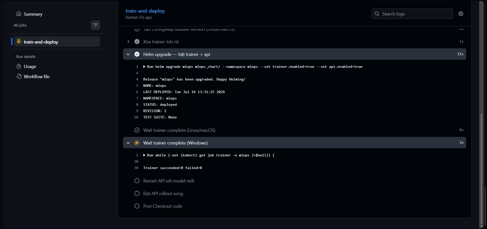

Pipeline hoàn thành sau **4 giờ 6 phút** — bao gồm 20 Optuna trials, evaluate test set, register model và rollout API.

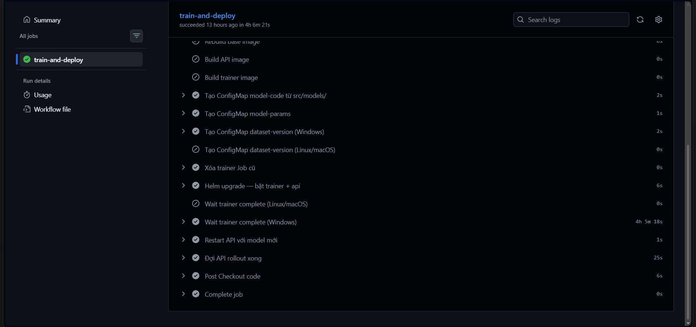

---

### 4. Experiment Tracking — MLflow

MLflow trống trước khi train lần đầu.

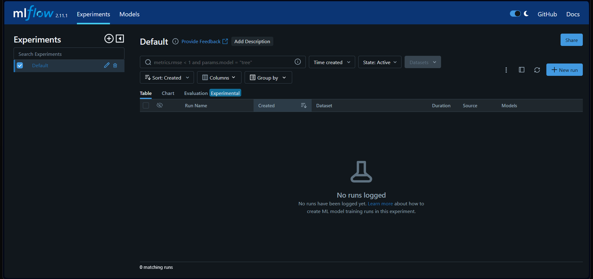

Sau training: 21 runs — 1 parent study và 20 child trials. Mỗi trial log đầy đủ params, metrics, model artifact.

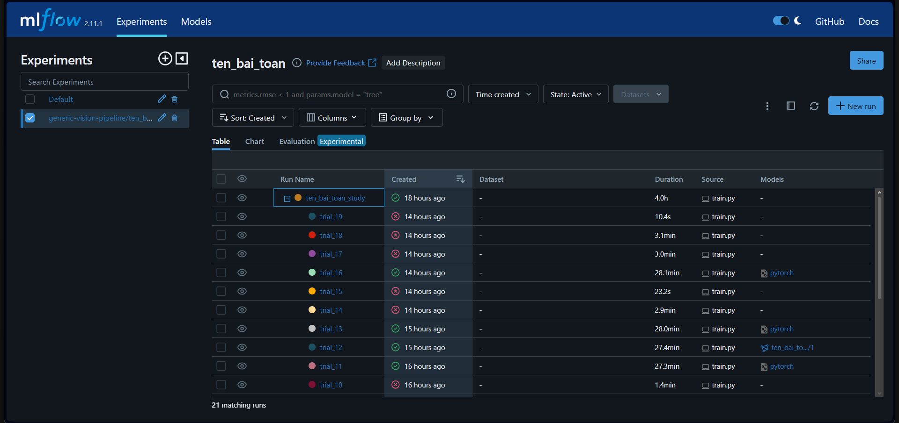

Learning curves của một trial — val_f1 và val_acc tăng đều, val_loss giảm hội tụ ổn định.

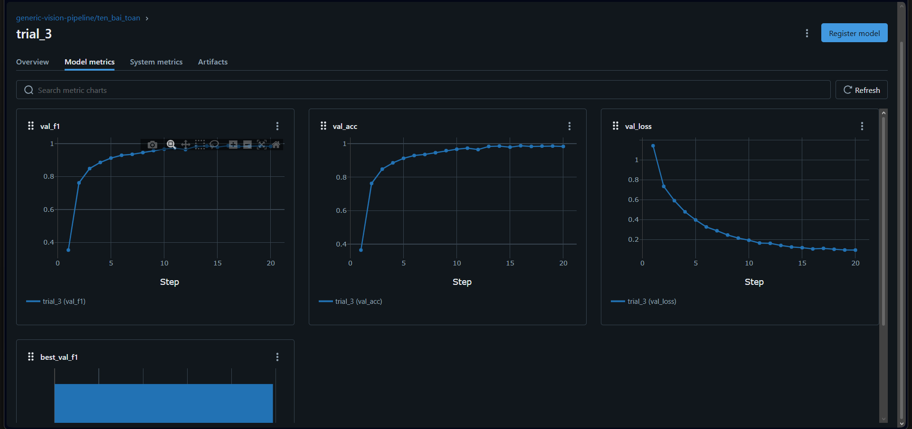

Trial tốt nhất (trial_12 — ResNet18, SGD) được tự động register vào MLflow Model Registry với alias `champion`.

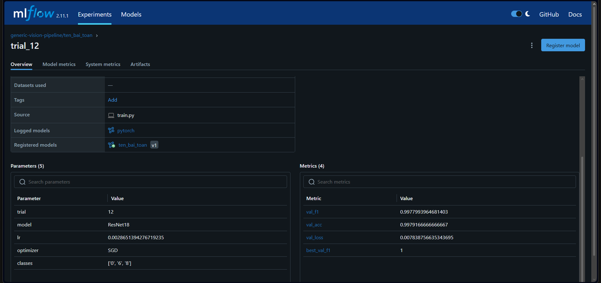

Parent run tổng hợp kết quả toàn bộ study: **test_f1 = 0.993**, **test_acc = 0.993** trên 600 ảnh test.

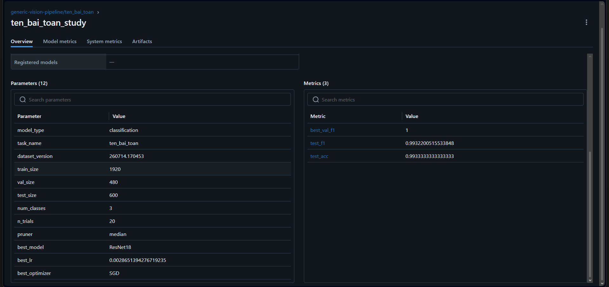

---

### 5. Serving API

FastAPI expose 4 endpoints. Swagger UI tự động sinh từ code.

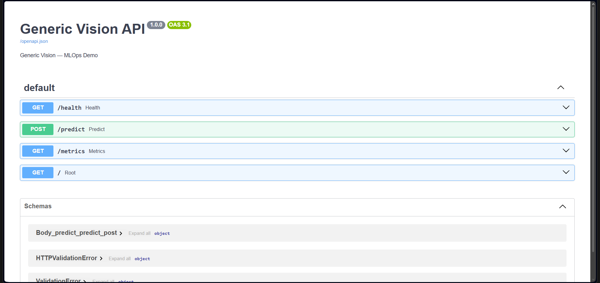

`GET /health` — kiểm tra model đã load, trả về tên model, alias, danh sách classes và img_size.

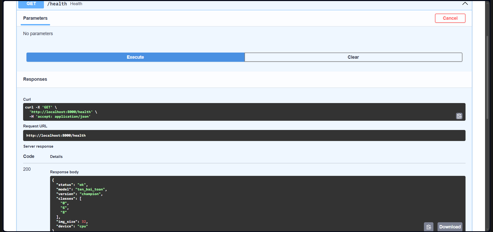

`POST /predict` — nhận ảnh, trả về class dự đoán, confidence và top-3 results.

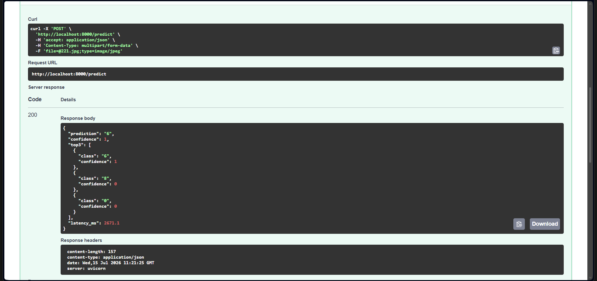

---

## Tài liệu

- [docs/SETUP.md](docs/SETUP.md) — Cài tools, cấu hình, chạy setup script lần đầu
- [docs/USAGE.md](docs/USAGE.md) — Thêm data, thêm model, chạy thủ công, CI/CD flow
